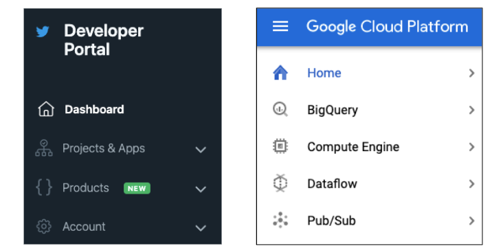
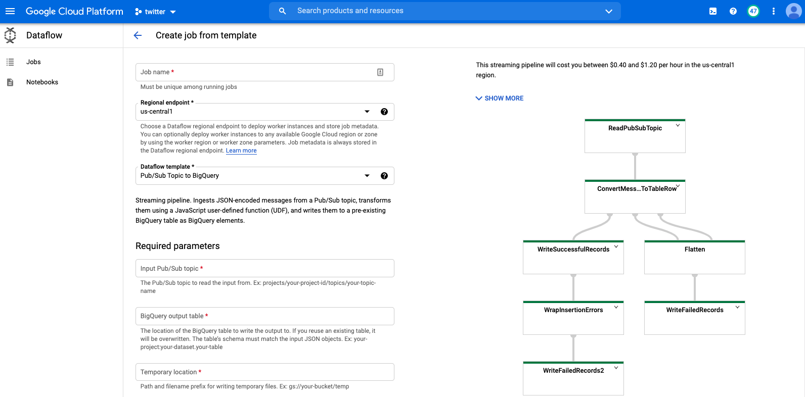
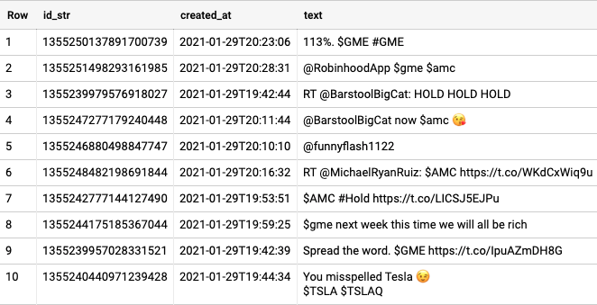

# Project Overview

Let's say you're someone who knows some Python, has spent time on Google Cloud Platform, and would like to work with streaming data from Twitter (either because you're curious or, like me, you wanted practice building a streaming data pipeline from start to finish). I set out to do this very thing and I found some good high-level resources to help guide me. But most tended to skip over some of the nitty gritty details needed to make the thing work.

So I decided to build this pipeline and document everything along the way with the intention of making it a little easier for others to do the same in the future. In the end, I came out with a blueprint for a data pipeline that lets you stream in tweets on topics that interest you. (The chart above, for example, shows a sample run of the pipeline for about 30 minutes, streaming in all tweets about various stock ticker symbols.)

So without further ado, here's my attempt at providing a step by step guide to building a pipeline for analyzing streaming data from Twitter.

# Pipeline Blueprint

This pipeline mainly relies on: the Twitter API, Python, and GCP. 

The Python script in this repo (`stream-to-pubsub.py`) runs on a GCP VM and accesses the Twitter API (credentials are stored in and pulled from Secret Manager), listens for tweets with specific search terms (the script will prompt you to enter which phrases or hashtags you want the script to listen for), and sends them to Pub/Sub. Those Pub/Sub messages are then delivered to BigQuery via Dataflow and, finally, can be visualized using tools like DataStudio.

Here's a way to visualize the pipeline:

## Prereqs

You'll need: 1) Twitter Developer credentials and 2) a GCP account set up:

Once you have a Twitter Developer account, you'll need an app, API consumer key (and secret), and access token (and secret). 

(You may need to enable to the relevant APIs on your GCP account - Compute Engine, GCS, Dataflow, and BigQuery. You can do that using the search bar at the top of the GCP interface.)

## The pipeline

Now let's start setting everything up, from the VM to Pub/Sub to the Dataflow job. Most of the work is done upfront with setting up the VM, so there will be a lot of detail in this first section.

### Send messages from Twitter API to Pub/Sub

The first part of the pipeline involves sending tweets from the Twitter API to Pub/Sub using the Python script `stream-to-pubsub.py`. For this script to run successfully, you'll need to:

1. Setup a VM where you can run the script
2. Enter your Twitter API credentials in Secret Manager
3. Create a Pub/Sub topic to receive messages from the Twitter API. 

#### 1. Setup VM:
* Under the Compute Engine tab on GCP, create a Debian 10 VM. Make sure to allow access to all APIs. (In my case, I set up an `e2-small` machine in zone `us-east-4a`.)
* Now, SSH into the VM. From the command line, check for Python 3, install pip, and setup a packaging tool (in your VM, run each of the commands listed [here](https://www.digitalocean.com/community/tutorials/how-to-install-python-3-and-set-up-a-programming-environment-on-debian-10) in `Step 1`).
* Then install `tweepy`, `google-cloud-secret-manager`, and `google-cloud-pubsub` using `pip3`.
	* Note: I ran into a problem where Secret Manager wouldn't finish installing (others have had [the same issue](https://github.com/grpc/grpc/issues/22815)). But I upgraded pip (with `pip3 install --upgrade pip`), reran the install, and it finished quickly.
* Finally, install `git` (`sudo apt install git`) and clone this repo.

#### 2. Add Twitter API credentials

Now you need to add your Twitter API access credentials to GCP Secret Manager. Within Secret Manager, create a secret for each of the 4 credentials you'll need for the script to access the Twitter API and name them accordingly (`twitter-api-key`, `twitter-api-secret`, `twitter-access-token`, and `twitter-access-token-secret`). Lastly, add `Secret Manager Secret Accessor` to the Compute Engine default service account in IAM.

#### 3. Create Pub/Sub topic

Create a Pub/Sub topic and name it accordingly (something like `twitter` will work). Then modify the `project-specs.json` file in this repo using the project and Pub/Sub topic info from your GCP account (you can find that info in the `Home` tab on GCP).

#### Give it a whirl!

*Sample of script running*

Now, try running the script (`python3 stream-to-pubsub.py`) to make sure that it actually works on the VM. If it does, then move on to the next part.

### Send Pub/Sub messages to BigQuery via Dataflow

Now that the VM works and the Python script can run on the VM, you need a Dataflow job to take the messages that Pub/Sub will receive while the streaming script is running and transform and send those messages to BigQuery. To do that, you can use a GCP template for connecting Pub/Sub to BigQuery:

Note that you'll need a GCS bucket to temporarily store files coming in from Dataflow and you'll also need an empty table in BigQuery (use `bq-schema.json` when creating the BQ table) to receive the streaming data.

Once those are ready, you can start the Dataflow job and run the script from your VM. Wait a few minutes and you should start to see rows populating in your BigQuery table:

## Visualize Results Using DataStudio (WIP)

*Sample final output from pipeline showing result from streaming in tweets about Bitcoin*

So far, I've played around with visualizing the data in Data Studio but haven't figured out how to make the timeseries chart update continuously to reflect the arrival of new data. I think there might be a way to do it in Data Studio but I'll have to keep tinkering.

## Troubleshooting

### Python script/VM

Receiving 401s when you run the script? 
* Make sure you've entered the correct API credential information in Secret Manager (you may need to regenerate credentials. Twitter seems to reject credentials after a certain period of time but I'm not sure exactly how long credentials do or don't last.
* If your credentials check out, the problem may be that the VM's internal clock is inaccurate. The VM's clock can be delayed if you pause the VM. Try **stopping** and restarting the VM. This should reset the clock (run `timedatectl` within the VM and check to see if `System clock synchronized` is set to `yes`). If you do want to put the VM on hold in the future, it may be better to stop it altogether rather than pause.

Getting connection errors?

This one has been trickier to solve. I've added a few parameters to the script to try and prevent the stream from breaking. The only other thing that might help is, if you're running the VM within a Chrome browser (like I did), make sure you have the most up-to-date version of Chrome.

### Dataflow

If your Dataflow job doesn't run, you should double check to make sure that the necessary Dataflow APIs have been enabled (using the command `gcloud services enable dataflow.googleapis.com`).

## Notes

To get this project off the ground, I initially borrowed code from here:

https://github.com/TDehaene/blogposts/tree/master/got_sentiment